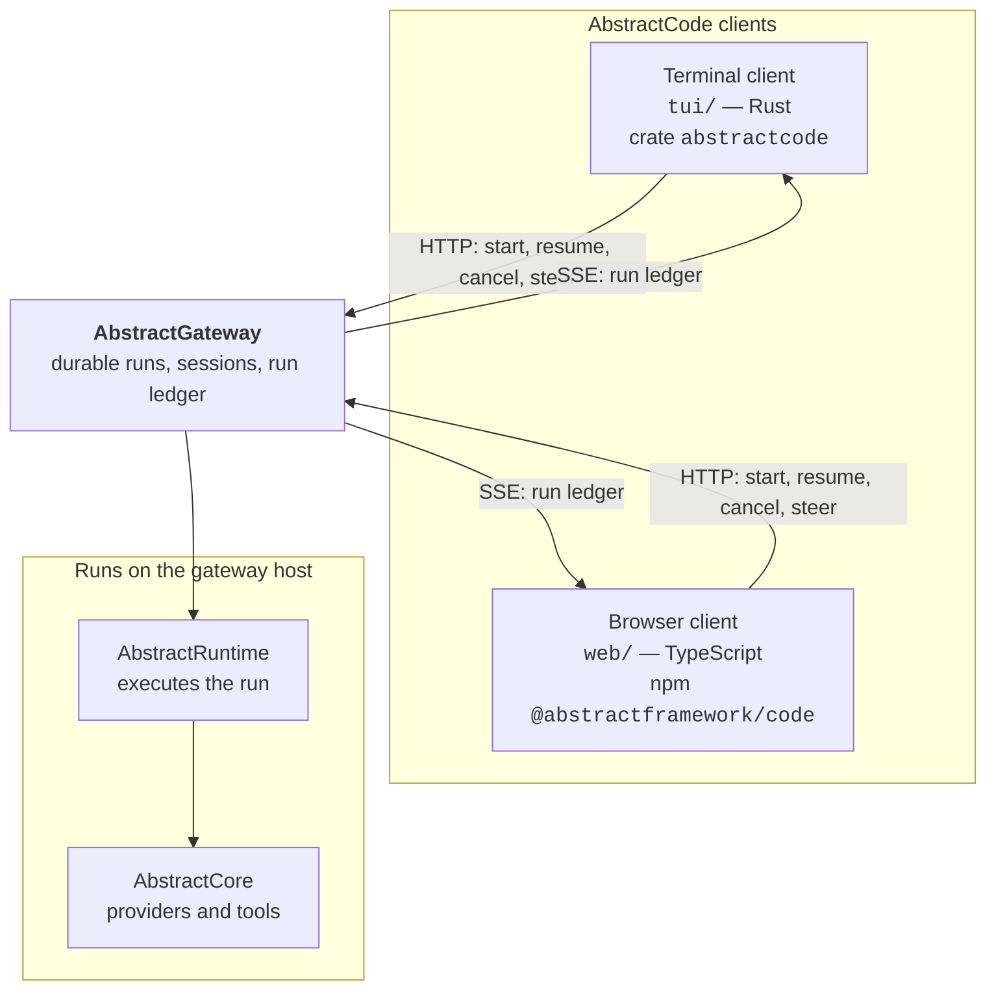
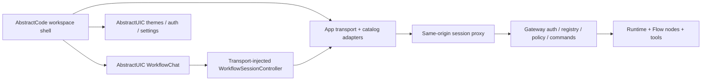

# Architecture

AbstractCode is two clients over one durable control plane. Neither client runs
the coding agent; both observe and steer a run that lives on
[AbstractGateway](https://github.com/lpalbou/abstractgateway).

## Shape



Both clients speak the same surface, so a session is portable between them: a
run gated on approval in the terminal can be approved in the browser, and a run
started in the browser can be reattached from the terminal.

## The thin-client contract

Everything a client does goes through the gateway, and therefore the runtime.
Four rules follow, and they are binding on both clients:

1. **Server truth is the only truth about runs.** A client renders what the
   ledger says. It never invents a status the gateway did not report; unknown
   renders as unknown.
2. **Decisions are communicated, never executed locally.** Approvals, answers,
   cancels, pauses, and steering all travel as durable gateway commands, so they
   are traceable in the ledger and answerable from any client.
3. **Interface overlays on server truth must be honest and labelled.** Where a
   client's rendering deliberately diverges from raw server state, the
   divergence is named where you read it.
4. **Client-held state stays a client concern** — rendering, input, credentials,
   local preferences — plus intent you have not submitted yet, such as a
   composer draft. The moment intent becomes work, it is a gateway run.

The consequence you can rely on: start a task, disconnect, reconnect later, and
find the run where it actually got to.

## Repository layout

```text
tui/     the terminal client — Rust crate `abstractcode`, a workspace member
web/     the browser client — npm `@abstractframework/code`
docs/    documentation for the project as a whole
```

The Cargo workspace lives at the repository root with `tui` as its only member.
That keeps `target/` at the root while scoping `cargo` packaging to the crate,
so ordinary churn under `web/` cannot block a release.

The two clients version and release independently, each under its own tag
prefix — `v<version>` for the terminal client, `web-v<version>` for the browser
client. See [`../CONTRIBUTING.md`](../CONTRIBUTING.md).

## Boundaries

- **No client-side agent loop.** Neither client decides what the model does next;
  the runtime does.
- **No shared code between the clients.** They are separate implementations of
  the same wire contract in different languages, deliberately: each is idiomatic
  for its platform. The contract they share is the gateway's, documented in
  [`api.md`](api.md).
- **Shared browser components are package dependencies.** `web/` consumes
  AbstractUIC packages from the npm registry, without sibling-checkout aliases,
  so the checkout builds independently.

## Browser ownership



`panel-chat` owns reusable presentation and replay/stream state, including
questions, approvals, event waits, and structured results. It does not store
credentials, select workspace scope, or invoke tools. Code supplies the HTTP
adapter, workflow catalog, session navigation, schema inputs, and inspector.
The app server owns session exchange and CSRF/origin checks.

Run lifecycle comes from gateway run snapshots; a completed ledger step does
not imply a completed workflow. Ledger records own replayable messages and
activity. UI-only status events never replace authoritative run status.
Account and session changes abort or isolate pending requests and local queues.

The legacy `web/src/ui/` implementation is retained as unmounted source; the
entrypoint mounts only `web/src/workspace/app.tsx`.
