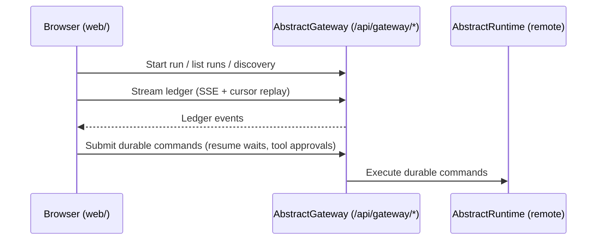

# AbstractCode architecture

> Last verified: 2026-02-09  
> Scope: what is implemented in this repo (no roadmap claims).

Start here: [`docs/getting-started.md`](getting-started.md).

AbstractCode is a **host UI** for running durable agent/workflow executions built on:
- **AbstractAgent** (agents)
- **AbstractRuntime** (durable runtime: runs, ledger, waits, artifacts)
- **AbstractCore** (provider/model abstraction + tool definitions)

This repo contains:
- Python CLI/TUI package: `abstractcode/`
- Gateway-first web host UI: `web/` (separate build; not part of the pip wheel)

Related:
- CLI/TUI reference: [`docs/cli.md`](cli.md)
- Workflows: [`docs/workflows.md`](workflows.md)
- UI events contract: [`docs/ui_events.md`](ui_events.md)
- Web overview: [`docs/web.md`](web.md)

## Big picture (CLI/TUI)

```mermaid
flowchart LR
  U[User\n(terminal)] -->|input| UI[FullScreenUI\n(prompt_toolkit)]
  UI <--> SH[ReactShell\n(command router + UX)]

  SH -->|start/tick| RT[AbstractRuntime\n(durable execution)]
  RT -->|LLM calls| LLM[AbstractCore LLM client\n(provider/model)]

  RT -->|tool calls (durable wait)| PTE[PassthroughToolExecutor\napproval_required]
  SH -->|approve + execute| MTE[MappingToolExecutor\n(local tools or MCP)]
  MTE -->|tool results| RT

  RT --> RS[RunStore\n(JsonFileRunStore / InMemoryRunStore)]
  RT --> LS[LedgerStore\n(JsonlLedgerStore / InMemoryLedgerStore)]
  RT --> AS[ArtifactStore\n(FileArtifactStore / InMemoryArtifactStore)]
  RT --> SS[SnapshotStore\n(JsonSnapshotStore / InMemorySnapshotStore)]
```

Evidence (implementation):
- CLI entrypoint + arg parsing: `abstractcode/cli.py`
- Interactive host: `abstractcode/react_shell.py` (`ReactShell`)
- UI: `abstractcode/fullscreen_ui.py` (`FullScreenUI`)
- Runtime wiring: `abstractcode/react_shell.py` (creates stores + `create_local_runtime(...)`)

## Web host (gateway-first)

The web app is a **thin host** that talks only to an AbstractGateway under `/api/gateway/*`.



Evidence (implementation):
- Gateway client + endpoints: `web/src/lib/gateway_client.ts`
- UI rendering from ledger stream: `web/src/ui/app.tsx`

## Repository layout

```text
abstractcode/                 # Python package (published to pip)
  __init__.py                 # console entrypoint: abstractcode:main
  __main__.py                 # module entrypoint: python -m abstractcode
  cli.py                      # argparse CLI + subcommands (flow/workflow/gateway)
  react_shell.py              # interactive shell + command routing
  fullscreen_ui.py            # prompt_toolkit full-screen UI
  input_handler.py            # prompt_toolkit input helpers
  terminal_markdown.py        # markdown rendering for terminal output
  theme.py                    # themes + env overrides
  file_mentions.py            # @file parsing + workspace mount resolution
  recall.py / remember.py     # memory UX helpers (host-side)
  flow_cli.py                 # local VisualFlow runner (requires abstractflow extra)
  workflow_agent.py           # run VisualFlow as an agent (abstractcode.agent.v1)
  workflow_cli.py             # manage .flow bundles on a gateway
  gateway_cli.py              # gateway HTTP client (runs, ledger follow, bundles, KG)

web/                          # Web host UI (separate Node/Vite app)
docs/                         # Documentation for this repo/package
tests/                        # Test suite
```

## Execution modes

### 1) Interactive agents (default)

Command: `abstractcode ...`

Dispatch:
- `abstractcode/cli.py` constructs a `ReactShell` and enters the TUI loop.
- Built-in agent kinds are selected by `--agent` (`react|memact|codeact`).

Evidence:
- Agent selection + shell creation: `abstractcode/cli.py`
- Agent wiring + toolset selection: `abstractcode/react_shell.py`

### 2) One-shot (`--prompt`)

Command: `abstractcode --prompt "..." ...`

Behavior:
- runs a single task, prints the final answer, exits
- supports `@file` mentions (attachments are stored in the ArtifactStore)

Evidence: `abstractcode/cli.py::_run_one_shot_prompt()`.

### 3) Local VisualFlow runs (`abstractcode flow ...`)

Commands: `abstractcode flow run|resume|pause|...`

Behavior:
- runs VisualFlow workflows locally with durable stores, separate from the agent state file

Evidence:
- CLI parsing: `abstractcode/cli.py::build_flow_parser()`
- Flow driver: `abstractcode/flow_cli.py`

### 4) Workflow agent (`abstractcode --agent <flow_ref>`)

Runs a VisualFlow workflow as a first-class “agent” in the TUI, using the `abstractcode.agent.v1` contract.

Evidence: `abstractcode/workflow_agent.py` (`WorkflowAgent`).

### 5) Gateway control-plane (`abstractcode gateway ...`)

Commands: `abstractcode gateway run|attach|kg`

Behavior:
- starts/attaches to remote runs via gateway HTTP endpoints
- can query the persisted KG via the gateway (when enabled server-side)

Evidence: `abstractcode/gateway_cli.py`.

## Durability + tool approvals (core invariant)

AbstractCode keeps runs durable by persisting only JSON-safe state:
- tool **specs** and **requests** can be persisted
- tool **callables** are never persisted; they stay in the host process

Approval boundary (TUI):
1) runtime emits a durable wait for tool calls (`approval_required`)
2) host prompts the user (or auto-approves)
3) host executes tools (local or via MCP) and resumes the run with results

Evidence:
- Passthrough executor: `abstractcode/react_shell.py` (`PassthroughToolExecutor(mode="approval_required")`)
- Local executor: `abstractcode/react_shell.py` (`MappingToolExecutor.from_tools(...)`)

## Prompt caching (best-effort)

AbstractCode can enable prompt caching to reduce repeated *prefill* work (improves TTFT for long, stable prefixes).

### Toggle surface

- CLI: `--prompt-cache auto|on|off` (default: `auto`) / `ABSTRACTCODE_PROMPT_CACHE`
- TUI: `/cache auto|on|off`

In `auto`, AbstractCode enables caching only when the runtime AbstractCore LLM client reports prompt-cache support via `get_prompt_cache_capabilities(...)`.

### How it works (local runtime)

1) AbstractCode stores the policy in run vars: `run.vars["_runtime"]["prompt_cache"]` (bool or object).
2) AbstractRuntime injects a `prompt_cache_key` into each LLM call (unless the caller explicitly set one).
3) The local AbstractCore client uses that key to maintain caches:

- Builds immutable prefix caches for `system` and `tools` via `provider.prompt_cache_prepare_modules(...)`.
- Forks the final prefix cache into the per-session key via `provider.prompt_cache_fork(...)`.
- Appends new history messages incrementally via `provider.prompt_cache_update(...)`.
- Rebuilds the per-session history cache if the history diverges (edits/truncation), while reusing the prefix caches when possible.

This yields a 3-compartment cache layout: `system | tools | history` — changing one compartment doesn’t require rebuilding the others.

### Provider support

- Backends that report `mode=local_control_plane`: full module/fork/update caching.
- Today that includes MLX and GGUF models whose llama.cpp chat format can be rendered exactly for cached prefixes (currently `chatml-function-calling` and `llama-3`).
- Backends that report `mode=keyed`: stable per-session cache keys, but no local module/fork/update control plane.
- Remote APIs: `prompt_cache_key` is forwarded when applicable, and remote prompt-cache control-plane access depends on the configured `/acore/prompt_cache/*` surface.

Evidence:
- Policy + key wiring: `abstractcode/react_shell.py`
- Injection: `abstractruntime/src/abstractruntime/integrations/abstractcore/effect_handlers.py`
- Module caching logic: `abstractruntime/src/abstractruntime/integrations/abstractcore/llm_client.py`

## Workflow-driven UX events

Workflows can emit `emit_event` effects (ledger-backed) to request host UX updates:
- status text: `abstract.status`
- messages: `abstract.message`
- tool blocks: `abstract.tool_execution`, `abstract.tool_result`

Contract + payload shapes: [`docs/ui_events.md`](ui_events.md).

Evidence:
- Ledger subscription + normalization: `abstractcode/workflow_agent.py::_subscribe_ui_events()`
- TUI rendering: `abstractcode/react_shell.py` (`_on_step(...)`)
