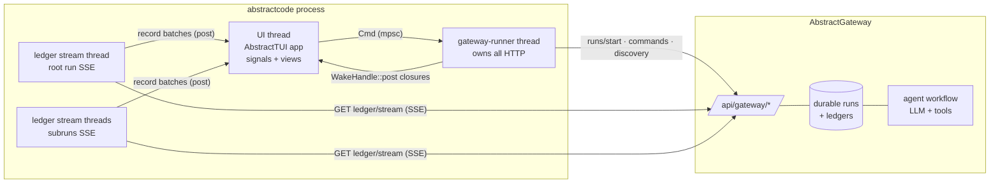
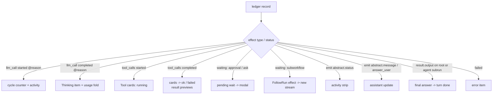

# Architecture

abstractcode is a **thin client**: the agent executes on an
AbstractGateway, and this process renders the run's durable ledger as it
grows. Nothing intelligent happens client-side — that is the design. The
run survives client crashes; two clients can watch the same run; the
transcript's source of truth is the gateway's ledger, never client memory.

## System view

## Threading contract

One rule, enforced everywhere: **the UI thread owns every reactive signal**.

- UI → worker: an mpsc channel of `Cmd` values (`Start`, `Resume`, `Steer`,
  `Cancel`, `Follow`, `FetchImage`, …). Handlers never block on HTTP.
- Worker → UI: `abstracttui::reactive::WakeHandle::post` closures. The
  closure captures `Send` data (the record batch, `Copy` signal handles) and
  runs on the UI thread, where it writes signals.
- Each followed run gets its own stream thread with a stop flag. Starting a
  new run flips every previous flag; posted closures additionally re-check
  that their records belong to the fold's current run tree
  (`Fold::is_following`), so a stale stream can never contaminate a new run.

## The ledger fold

A gateway run emits an append-only ledger of step records:
`{run_id, node_id, status, effect{type, payload}, result, error}`. The fold
(`src/transcript.rs`) turns that stream into UI state:

Properties that carry the correctness weight:

- **Replay-safe**: reconnects and reattach replay records from a cursor (or
  from zero). Wait keys and tool call ids are seen-once sets, so answered
  approvals never re-prompt and tool cards never duplicate.
- **Wait resolution follows the references**: the canonical wait location is
  `result.wait`; tool approval is `details.mode == "approval_required"` (or
  embedded `tool_calls`, or a `tool_approval:` wait key); a later record from
  the waiting run clears a stale prompt (ledger order is the argument).
- **The answer can come from a subrun.** Wrapper bundles keep helper
  subflows (status watchers) running after the agent answered, so the fold
  accepts a flow output from the run currently emitting reasoning cycles —
  the agent loop — as the turn's answer, and the UI releases the composer
  immediately while the root finalizes server-side.

## Streaming: SSE first, polling fallback

`GET /runs/{id}/ledger/stream` delivers `event: step` frames
(`data: {cursor, record}`) with keep-alive comments and a final
`event: done`. Each stream thread:

1. streams from its cursor, posting one batch per network read (arrival
   cadence — approvals must surface the moment they land);
2. on idle timeout or clean close without `done`, checks run status and
   reconnects from the cursor;
3. on transport errors, falls back to polling `GET /runs/{id}/ledger`
   pages with capped backoff until the stream works again;
4. on `done` (root only), reads the final status and reports the terminal
   state.

The `exec` subcommand uses the polling path exclusively, so both transports
stay exercised.

## Sessions and steering

- **Sessions**: the client mints a durable session id and passes
  `use_session_history: true` in run input; the gateway seeds prior turns
  server-side (the durable-sessions contract) — that covers restarts. LIVE
  turns additionally ride `context.messages` built from the fold's completed
  user/answer pairs (client messages win by contract): wrapper bundles can
  leave prior ROOT runs non-completed for a while (helper poller subflows),
  which starves a completed-roots-only seed — carrying the visible
  conversation makes follow-ups immune to that. `/new` rotates the id.
- **Steering**: submitting text while a run is active sends an
  `inject_guidance` command to the run currently cycling (the fold tracks
  which subrun that is); the runtime folds it into the next reasoning
  iteration through its durable steer sidecar.
- **Approvals**: `resume` commands target the waiting run id + wait key with
  `{"approved": true|false}` (or `{"response": …}` for ask-user waits). The
  UI clears the prompt optimistically and restores it if the resume is
  refused.

## Module map

| Module | Role |
| --- | --- |
| `src/config.rs` | Connection + preference resolution, and the login store. |
| `src/gateway/` | Blocking HTTP client (ureq), SSE parser, stream loop. |
| `src/protocol.rs` | Pure extraction over ledger records (waits, tools, usage, output). |
| `src/transcript.rs` | The fold: records → items, stats, pending waits; dedup sets; bounds. |
| `src/runner.rs` | Worker thread: commands, per-run stream threads, terminal detection. |
| `src/store.rs` | The signal store (UI-thread owned). |
| `src/ui/` | AbstractTUI views: chrome, transcript pane, modals. |
| `src/cli.rs`, `src/exec.rs` | CLI parsing, `login`/`doctor`, headless one-shots. |

## Testing model

- **Unit**: protocol extraction and the fold, including a fixture of REAL
  captured ledger records (tool approval round-trip included).
- **Replay**: `tests/run_tree_replay.rs` re-drives a captured four-run tree
  (root + two helper subflows + the agent subrun) through the fold the way
  the runner interleaves it.
- **Headless UI**: `tests/headless_ui.rs` drives the real interface through
  AbstractTUI's capture harness — real input dispatch, real damage, screen
  assertions — no pty.
- **Live**: `scripts/pty_live_smoke.py` forks the binary under a real
  controlling pty against a live gateway: boot → prompt → approval modal →
  `a` → answer → clean Ctrl+C exit, with filesystem proof of the tool write.

## Honest limits

- Attachments (`@file`) are not implemented in this client yet.
- Right after a drag-selection, a leading `c` or a bare Enter is consumed
  by the engine's selection layer as a copy key (the region stays visible
  after the release-copy); any other keystroke clears it. Engine-side fix
  filed (abstracttui backlog 0290).
- The `/` completion dropdown can land on the status-bar row when it has
  only 1–2 candidates and the composer sits at the bottom of a short
  terminal (engine placement policy; filed as abstracttui backlog 0294).
  It is transient and clears as you type.
- Markdown tables render as plain text lines (an AbstractTUI MarkdownView
  limit today).
- Images render as unicode mosaic through the transcript (pixel-protocol
  placement for kitty/iTerm2 is an engine capability not yet wired here).
- Windows is unverified for this crate end-to-end.
